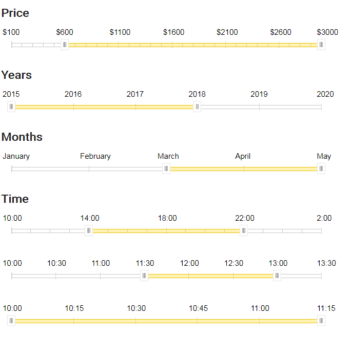

# Range Slider for your react app

A common component to select numeric ranges.

## Features
 * Draggable handles
 * Draggable selectedRange
 * Handles can be crossed

**[DEMO](https://tanyaignatenko.github.io/react-range-slider/)**

## Screenshots


## Usage
````js
import React, { useState } from 'react';
import ReactDOM from 'react-dom';
import RangeSlider from 'react-range-slider';

const toPriceLabel = price => `$${price}`;

function App() {
  const [selectedPriceRange, setSelectedPriceRange] = useState({
    start: 600,
    end: 3000,
  });

  return (
    <RangeSlider
      min={100}
      max={3000}
      valuePerStep={100}
      labelMarkStep={5}
      selectedRange={selectedPriceRange}
      onChange={setSelectedPriceRange}
      formatLabel={toPriceLabel}
    />
  );
}

ReactDOM.render(<App />, document.getElementById('app'));
`````
## API

### `min: number`

Set a minimum value that can be selected

### `max: number`

Set a maximum value that can be selected

### `selectedRange: { start: number, end: number }`

Set current selected range. Have no effect while drag happening.

### `onChange: (range: { start: number, end: number }): void`

Whenever user drags slider handles/range, this function gets called. Inside the function, you should assign a new selected range to your component.

### `formatLabel: (value: number): string`

Format label of given value.

### `valuePerStep?: number`

Set step to get next value from current.
Default: 1. 

### `labelMarkStep?: number`

Set step per which label mark would be printed.
Default: 4. 

### `className?: string`

Add className to component outermost container. 
Default: ''. 
## License

MIT
